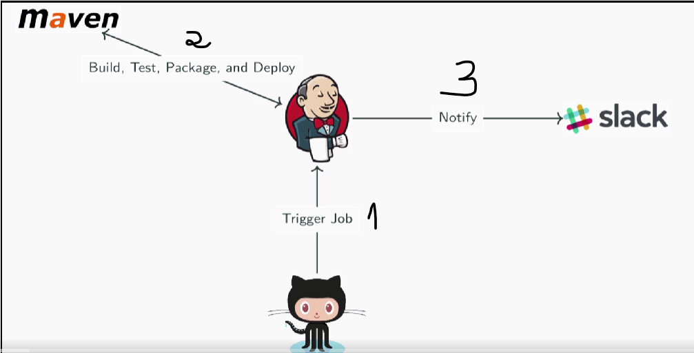

### Jenkins installation

* Create an EC2 instance on AWS.

* ssh to the EC2 your created.

* install Java: 
> sudo yum install -y java-11-openjdk

* install wget: 
> sudo yum install -y wget

* Download the repo: 
> sudo wget -O /etc/yum.repos.d/jenkins.repo https://pkg.jenkins.io/redhat-stable/jenkins.repo

* Import the required key: 
> sudo rpm --import https://pkg.jenkins.io/redhat-stable/jenkins.io-2023.key

* Install Jenkins: 
> sudo yum install -y jenkins

* Enable Jenkins:
> sudo systemctl enable jenkins

* Start Jenkins:
> sudo systemctl start jenkins

* In a new browser tab, navigate to http://<PUBLIC_IP_ADDRESS>:8080, replacing <PUBLIC_IP_ADDRESS> with the IP address of the EC2 provided.

* We'll be taken to an Unlock Jenkins page telling us we need to locate the password. In the terminal, run:
> sudo cat /var/lib/jenkins/secrets/initialAdminPassword

* Copy the result of the command, as this is the password we need.

* Paste the password into the Administrator password field on the Jenkins browser page.

* Click Continue.

* Click Install suggested plugins. Note: If the install of any plugins fails, just wait a moment and click retry.

* Create a new user with your own information.

* Click Save and Continue.

* Click Save and Finish.

* Click Start using Jenkins.

#### Hans-on 1 : *** Building in Jenkins**

* Install Jenkins on EC2

* Once logged in to Jenkins, click New Item in the left pane.

* From the list of available item types, select Folder.

* Click OK.

* Click Save to accept the default configurations for the folder.

* In the Test folder you just created, click the create new jobs link.

* In the Enter an item name field, type "user_test".

* From the list of available item types, make sure that Freestyle project is selected.

* Click OK.

* In the configuration for the project, scroll down to the Build section and click the Add build step drop-down arrow.

* From the drop-down menu, select Execute shell.

* In the Command text box, add the code containing the uname and whoami commands required to output the desired information to the requested file name:

> uname -a && whoami > user_test.txt

* Click Save.

* In the user_test project, click Build Now in the left pane.

* Verify that the build completes in the Build History pane.

* Once completed, click Workspace in the project pane.

* Click the view link to the right of the user_test.txt file.

* Verify that the output in the file displays jenkins.

* Click the back button in the browser window.

* Click on the drop-down arrow next to the build in the Build History pane and click Console Output.

#### Hands-on 2 : Building from SCM

<h6> Learning Activity</h6>

> Your company is ready to start utilizing the jenkins server that you installed.The first project that they would like to convert to run on jenkins is a marven project from your companies M3 marven server.This is to replace that server, but project build there have the instance name hardcoded. You are to pull the project from the git repo and build the project.This should include the call to goland that creates the index.jsp file(go build bin/makeindex). The index.jsp file needs to be tracked for version control purposes.

* Log in to jenkins with your credentials.

* Click the bell icon.

* Apply Migration.

* Click the bell icon.

* Choose Manage Jenkins.

* Choose Go to plugin manager.

* Select all, Download now and install after restart

* Wait to checkmark the "Restart Jenkins when installation is complete and no jobs are running" until all items have been marked for an action.

* Reconnect to Jenkins.

* Click Manage Jenkins.

* Click Global Tool Configuration.

* Under Maven installations, click Add Maven.

* In the Name box, enter "M3".

* Make sure Install automatically is checked.

* Click Save.

* Select Freestyle project.

* Click OK.

* Click the Source Code Management tab at the top of the screen.

* Select the option for a Git repository.

* Copy the git repository link and enter it into the Repository URL box.

* Click Save.

* Click Build Now.

* Click Configure, then Build Steps.

* Click Add build step and select the Invoke top-level Maven targets option.

* Under Maven Version, select M3.

* In the Goals box, enter "clean package".

* Click Add build step and select the Execute shell option.

* In the Command window, enter "bin/makeindex".

* Click Add post-build action and select the Archive the artifacts option.

* Inside the Archive the artifacts box, click Advanced...

* Check the option for Fingerprint all archived artifacts.

* In the Files to archive box, enter "index.jsp".

* Click Save.

* Click Build Now.

* Refresh the window and click the View link next to index.jsp. Verify the contents of the index.jsp file.

#### Hands-on 3 : Building an Application as a Freestyle Jenkins Project

<h6> The Scenario</h6>

The team has asked us to configure a Jenkins project to build the train-schedule app. The source code for the application is hosted in the GitHub repository. The app already has build automation set up using gradle wrapper, and can be built with ./gradlew build. The team wants Jenkins to execute this automated build every time changes are pushed to the GitHub repository.

We will need to:

* Configure Jenkins to authenticate with GitHub
* Create a freestyle project in Jenkins
* Configure the project to build the train-schedule app
* Set up a webhook to trigger the build whenever changes are made to the repository in GitHub
* Configure the build to archive trainSchedule.zip as a build artifact

#### Hands-on 3 : Impliment a CI workflow

<h6> The workflow will be as below:</h6>

